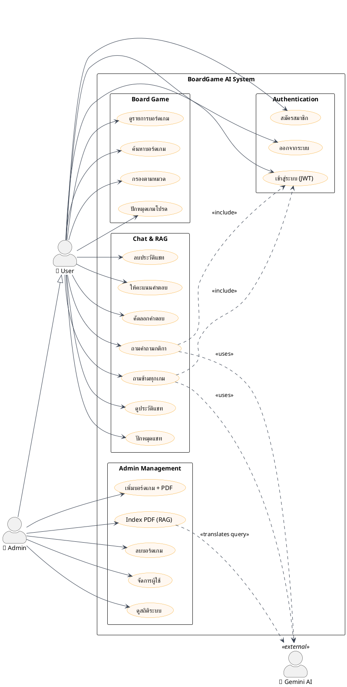
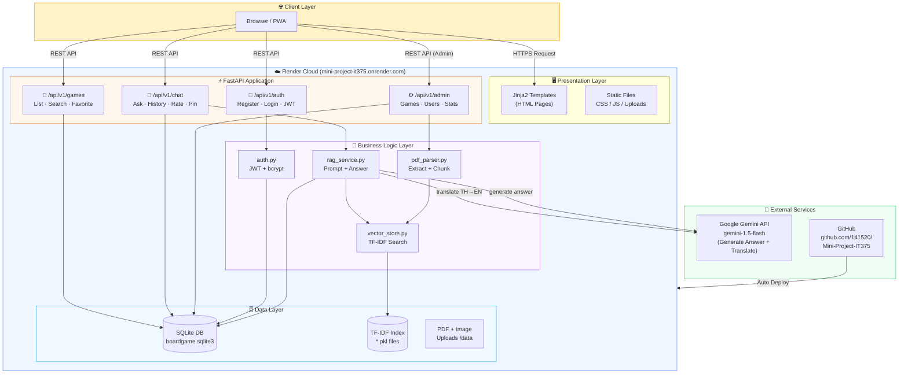
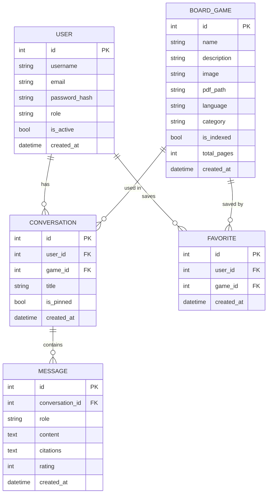

# BoardGame AI — Diagrams

## วิธีดู
- **UseCase / Architecture (Mermaid):** วางโค้ดใน [mermaid.live](https://mermaid.live)
- **UseCase (PlantUML):** วางโค้ดใน [plantuml.com/plantuml](https://www.plantuml.com/plantuml/uml/)

---

## 1. Use Case Diagram (PlantUML)

---

## 2. System Architecture Diagram (Mermaid)

---

## 3. Database ER Diagram (Mermaid)

