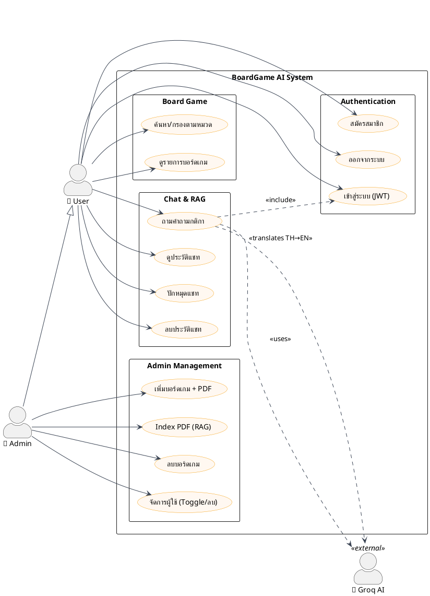
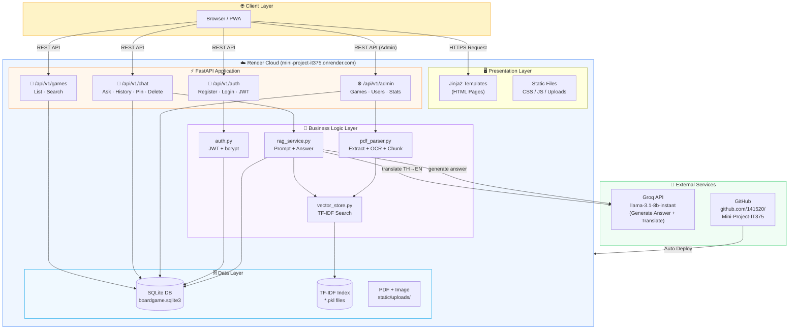
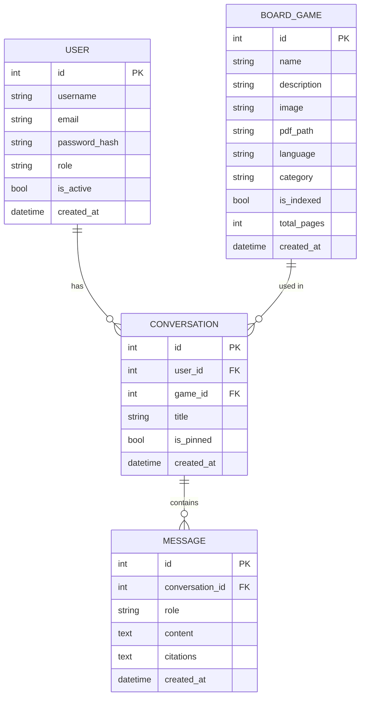

# BoardGame AI — Diagrams

## วิธีดู
- **UseCase / Architecture / ER (Mermaid):** วางโค้ดใน [mermaid.live](https://mermaid.live)
- **UseCase (PlantUML):** วางโค้ดใน [plantuml.com/plantuml](https://www.plantuml.com/plantuml/uml/)

---

## 1. Use Case Diagram (PlantUML)

```plantuml
@startuml BoardGame_AI_UseCase

skinparam actorStyle awesome
skinparam packageStyle rectangle
skinparam usecase {
  BackgroundColor #FFF8F1
  BorderColor #F59E0B
  ArrowColor #374151
  ActorBorderColor #374151
  ActorBackgroundColor #FEF3C7
}

left to right direction

actor "👤 User" as User
actor "🔧 Admin" as Admin
actor "🤖 Groq AI" as AI <<external>>

rectangle "BoardGame AI System" {

  package "Authentication" {
    usecase "สมัครสมาชิก" as UC_Register
    usecase "เข้าสู่ระบบ (JWT)" as UC_Login
    usecase "ออกจากระบบ" as UC_Logout
  }

  package "Board Game" {
    usecase "ดูรายการบอร์ดเกม" as UC_ListGames
    usecase "ค้นหา/กรองตามหมวด" as UC_SearchGames
  }

  package "Chat & RAG" {
    usecase "ถามคำถามกติกา" as UC_Ask
    usecase "ดูประวัติแชท" as UC_History
    usecase "ปักหมุดแชท" as UC_PinChat
    usecase "ลบประวัติแชท" as UC_DeleteChat
  }

  package "Admin Management" {
    usecase "เพิ่มบอร์ดเกม + PDF" as UC_AddGame
    usecase "Index PDF (RAG)" as UC_IndexPDF
    usecase "ลบบอร์ดเกม" as UC_DeleteGame
    usecase "จัดการผู้ใช้ (Toggle/ลบ)" as UC_ManageUser
  }

}

' User flows
User --> UC_Register
User --> UC_Login
User --> UC_Logout
User --> UC_ListGames
User --> UC_SearchGames
User --> UC_Ask
User --> UC_History
User --> UC_PinChat
User --> UC_DeleteChat

' Admin inherits User
Admin --|> User
Admin --> UC_AddGame
Admin --> UC_IndexPDF
Admin --> UC_DeleteGame
Admin --> UC_ManageUser

' AI external
UC_Ask ..> AI : <<uses>>
UC_Ask ..> AI : <<translates TH→EN>>

' Include
UC_Ask ..> UC_Login : <<include>>

@enduml
```

> **การเปลี่ยนแปลงจาก diagram เดิม:**
> - เปลี่ยน `Gemini AI` → `Groq AI` (ใช้ LLaMA 3.1 8B Instant)
> - ลบ `คัดลอกคำตอบ` (ถูกตัดออกจากระบบ)
> - ลบ `ปักหมุดเกมโปรด` (ระบบ Favorite ถูกตัดออก — คงไว้แค่ปักหมุดแชท)
> - เพิ่ม `ค้นหา/กรองตามหมวด` (category filter)
> - อัปเดต `จัดการผู้ใช้` ให้ครอบคลุม Toggle + ลบ user

---

## 2. System Architecture Diagram (Mermaid)

```mermaid
graph TB
    subgraph CLIENT["🌐 Client Layer"]
        Browser["Browser / PWA"]
    end

    subgraph CLOUD["☁️ Render Cloud (mini-project-it375.onrender.com)"]
        subgraph WEB["🖥️ Presentation Layer"]
            Jinja["Jinja2 Templates<br/>(HTML Pages)"]
            Static["Static Files<br/>CSS / JS / Uploads"]
        end

        subgraph API["⚡ FastAPI Application"]
            AuthAPI["🔐 /api/v1/auth<br/>Register · Login · JWT"]
            GamesAPI["🎲 /api/v1/games<br/>List · Search"]
            ChatAPI["💬 /api/v1/chat<br/>Ask · History · Pin · Delete"]
            AdminAPI["⚙️ /api/v1/admin<br/>Games · Users · Stats"]
        end

        subgraph SERVICE["🧠 Business Logic Layer"]
            RAG["rag_service.py<br/>Prompt + Answer"]
            PDF["pdf_parser.py<br/>Extract + OCR + Chunk"]
            VS["vector_store.py<br/>TF-IDF Search"]
            Auth["auth.py<br/>JWT + bcrypt"]
        end

        subgraph DATA["🗄️ Data Layer"]
            SQLite[("SQLite DB<br/>boardgame.sqlite3")]
            Pickle[("TF-IDF Index<br/>*.pkl files")]
            Files["PDF + Image<br/>static/uploads/"]
        end
    end

    subgraph EXTERNAL["🔌 External Services"]
        Groq["Groq API<br/>llama-3.1-8b-instant<br/>(Generate Answer + Translate)"]
        GitHub["GitHub<br/>github.com/141520/<br/>Mini-Project-IT375"]
    end

    Browser -->|"HTTPS Request"| Jinja
    Browser -->|"REST API"| AuthAPI
    Browser -->|"REST API"| GamesAPI
    Browser -->|"REST API"| ChatAPI
    Browser -->|"REST API (Admin)"| AdminAPI

    AuthAPI --> Auth
    GamesAPI --> SQLite
    ChatAPI --> RAG
    ChatAPI --> SQLite
    AdminAPI --> PDF
    AdminAPI --> SQLite

    RAG -->|"translate TH→EN"| Groq
    RAG -->|"generate answer"| Groq
    RAG --> VS
    PDF --> VS
    VS --> Pickle

    Auth --> SQLite
    RAG --> SQLite

    GitHub -->|"Auto Deploy"| CLOUD

    style CLIENT fill:#FEF3C7,stroke:#F59E0B
    style CLOUD fill:#EFF6FF,stroke:#3B82F6
    style EXTERNAL fill:#F0FDF4,stroke:#22C55E
    style API fill:#FFF7ED,stroke:#FB923C
    style SERVICE fill:#FAF5FF,stroke:#A855F7
    style DATA fill:#F0F9FF,stroke:#0EA5E9
```

---

## 3. Database ER Diagram (Mermaid)

```mermaid
erDiagram
    USER {
        int id PK
        string username
        string email
        string password_hash
        string role
        bool is_active
        datetime created_at
    }

    BOARD_GAME {
        int id PK
        string name
        string description
        string image
        string pdf_path
        string language
        string category
        bool is_indexed
        int total_pages
        datetime created_at
    }

    CONVERSATION {
        int id PK
        int user_id FK
        int game_id FK
        string title
        bool is_pinned
        datetime created_at
    }

    MESSAGE {
        int id PK
        int conversation_id FK
        string role
        text content
        text citations
        datetime created_at
    }

    USER ||--o{ CONVERSATION : "has"
    BOARD_GAME ||--o{ CONVERSATION : "used in"
    CONVERSATION ||--o{ MESSAGE : "contains"
```

> **การเปลี่ยนแปลงจาก ER เดิม:**
> - ลบตาราง `FAVORITE` (ระบบ favorite ถูกตัดออก)
> - ลบ field `rating` ใน MESSAGE (ระบบ 👍👎 ถูกตัดออก)
